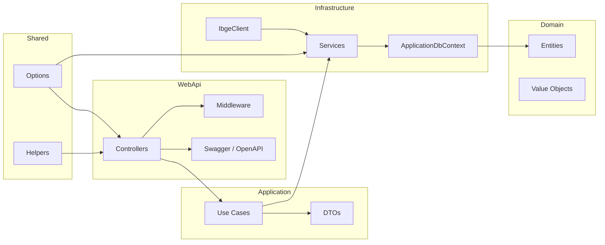
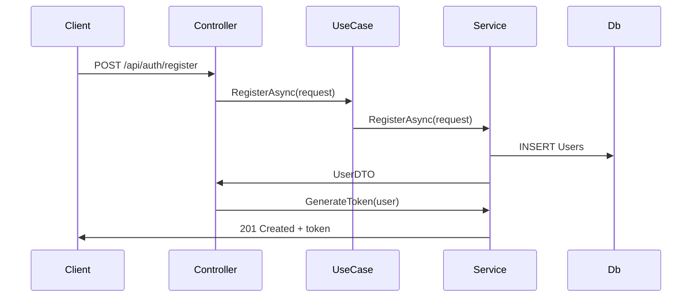
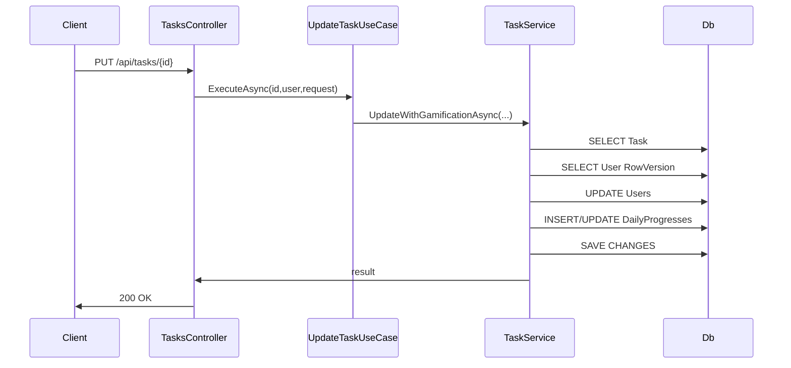

# RotinaXP - Backend API

## 1. Visão Geral do Sistema

### Objetivo
RotinaXP é uma API REST de gamificação de hábitos e produtividade. A aplicação permite que usuários registrem tarefas, conquistem pontos ao completar atividades, resgatem recompensas e acompanhem seu progresso diário.

### Problema resolvido
O sistema resolve o problema de motivação em rotinas pessoais e escolares: ele transforma atividades em recompensas e pontos, preserva histórico diário de progresso e cria um modelo de incentivo baseado em gamificação.

### Público alvo
- Usuários finais que desejam organizar tarefas diárias.
- Educadores e gestores interessados em acompanhar progresso e engajamento.
- Desenvolvedores ou equipes que precisam de uma API gamificada para integrar a um front-end.

### Benefícios
- Aumenta o engajamento pela recompensa de pontos.
- Garante histórico de progresso diário com contagem de tarefas concluídas.
- Provê controle de acesso e segurança via JWT.
- Suporta extensões administrativas com integração ao IBGE.

## 2. Arquitetura

### Arquitetura utilizada
O backend segue uma variante de Clean Architecture/Onion Architecture:
- `WebApi`: camada de entrada HTTP e apresentação.
- `Application`: casos de uso, DTOs e contratos de serviço.
- `Domain`: entidades do modelo de negócio.
- `Infrastructure`: implementação concreta de persistência, serviços e autorização.
- `Shared`: configurações e utilitários compartilhados.

### Justificativa
Esta separação garante:
- isolamento do domínio de infraestrutura;
- fácil teste de regras de negócio;
- troca de implementação de dependências sem alterar controladores;
- clareza de responsabilidades.

### Camadas e responsabilidades
- `WebApi`: valida requisições, autentica/autoriza, configura pipeline, expõe Swagger, mapeia rotas.
- `Application`: regras de orquestração, validações de entrada e fluxos de caso de uso.
- `Domain`: modelo de dados, agregados e objetos de valor.
- `Infrastructure`: Entity Framework Core, DB Context, serviços comuns, clientes HTTP externos.
- `Shared`: constantes, opções de configuração, helpers e atributos de validação.

### Diagrama de Arquitetura



## 3. Estrutura de Pastas

### Raiz do projeto
- `API.DOCUMENTATION.md`: documentação técnica principal.
- `README.md`: instruções de uso rápidas.
- `RotinaXP.API.sln`: solução .NET que referencia todos os projetos.
- `src/`: código-fonte da aplicação.
- `tests/`: testes unitários e de integração.

### `src/Core/RotinaXP.API.Domain`
- `Entities/`: classes do modelo de domínio.
  - `User.cs`
  - `TaskItem.cs`
  - `Reward.cs`
  - `DailyProgress.cs`
- `ValueObjects/`: classes de valor, como `Email.cs` e `Points.cs`.

### `src/Core/RotinaXP.API.Application`
- `DTOs/`: contratos de transporte de dados entre camadas.
- `Features/`: casos de uso organizados por agregado.
  - `Tasks/UseCases/`
  - `Rewards/UseCases/`
  - `Users/UseCases/`
  - `DailyProgress/UseCases/`
- `Interfaces/`: contratos para serviços e repositórios.
  - `Services/`
  - `Repositories/`
  - `Auth/`

### `src/Infrastructure/RotinaXP.API.Infrastructure`
- `Persistence/`: configuração do Entity Framework e migrations.
- `Services/`: implementação concreta de `IUserService`, `ITaskService`, `IRewardService`, `IDailyProgressService`, `JwtTokenService` e `IbgeService`.
- `Clients/`: `IbgeClient` para integração externa.
- `Authorization/`: handlers e requirements de políticas.
- `Security/`: `IPasswordHasher` e `BcryptPasswordHasher`.
- `Workers/`: componentes agendados ainda não integrados.

### `src/Shared/RotinaXP.API.Shared`
- `Options/`: classes de configuração mapeadas de `appsettings.json`.
- `Helpers/`: extensões de Claims, validação e constantes.

### `src/WebApi`
- `Controllers/`: APIs HTTP.
- `Middleware/`: `ExceptionHandlingMiddleware`, `CorrelationIdMiddleware`.
- `Extensions/`: métodos de extensão para DI e pipeline.
- `Swagger/`: operação customizada para endpoints administrativos.
- `Program.cs`: startup.
- `appsettings.json`: configurações de conexão, JWT, CORS e telemetry.

### `tests/`
- `Unit/`: testes focados em `RewardService`.
- `Integration/`: testes de contrato, autenticação, gamificação e IBGE.
- `CustomWebApplicationFactory.cs`: configuração de fábrica de teste com `InMemoryDatabase`.

## 4. Banco de Dados

### Entidades principais
- `Users`
  - `Id`: PK, identidade.
  - `Name`, `Email`, `PasswordHash`, `Role`, `Points`, `RowVersion`.
  - `Email` é único.
  - `RowVersion` é usado para controle de concorrência otimista.
- `Tasks`
  - `Id`: PK.
  - `Title`, `IsCompleted`, `UserId`.
  - FK para `Users` com `ON DELETE CASCADE`.
- `Rewards`
  - `Id`: PK.
  - `Title`, `PointsCost`, `UserId`.
  - FK para `Users`.
- `DailyProgresses`
  - `Id`: PK.
  - `Date`, `CompletedTasksCount`, `UserId`.
  - FK para `Users`.
  - Unique index em `(UserId, Date)`.

### Relacionamentos
- `User` 1 : N `TaskItem`
- `User` 1 : N `Reward`
- `User` 1 : N `DailyProgress`

### Chaves e constraints
- `Users.Email` possui índice único.
- `DailyProgresses` possui índice único em `(UserId, Date)` para impedir duplicidade diária.
- `Users.RowVersion` é token de concorrência, incrementado em operações atômicas de pontos.
- Índices adicionais para `UserId` em `Tasks`, `Rewards` e `DailyProgresses` melhoram consultas por usuário.

### Modelo de dados Mermaid

```mermaid
erDiagram
    USERS {
        int Id PK
        string Name
        string Email UNIQUE
        string PasswordHash
        string Role
        int Points
        long RowVersion
    }
    TASKS {
        int Id PK
        string Title
        bool IsCompleted
        int UserId FK
    }
    REWARDS {
        int Id PK
        string Title
        int PointsCost
        int UserId FK
    }
    DAILYPROGRESSES {
        int Id PK
        date Date
        int CompletedTasksCount
        int UserId FK
    }

    USERS ||--o{ TASKS : "has"
    USERS ||--o{ REWARDS : "has"
    USERS ||--o{ DAILYPROGRESSES : "has"
``` 

### Observações do banco
- A migration inicial cria as tabelas e relacionamentos.
- Uma migration posterior acrescenta `RowVersion` e a restrição única de `DailyProgresses`.
- A data em `DailyProgresses` é armazenada como `date`, facilitando agregações por dia.

## 5. Fluxo Completo das Requisições

### Autenticação e criação de usuário
1. Cliente chama `POST /api/auth/register`.
2. `AuthController.Register` chama `IUserService.RegisterAsync`.
3. `UserService` valida campos, criptografa a senha com `BcryptPasswordHasher`, cria o usuário e salva no banco.
4. Se sucesso, `JwtTokenService.GenerateToken` cria um JWT com os claims do usuário.
5. Resposta retorna `token`, `message` e `user` sem `passwordHash`.

### Login
1. Cliente chama `POST /api/auth/login`.
2. `AuthController.Login` chama `IUserService.LoginAsync`.
3. `UserService` verifica email e senha com `BCrypt.Verify`.
4. Em caso de sucesso, o mesmo `JwtTokenService` gera o token.

### Criar tarefa
1. Cliente chama `POST /api/tasks` com `userId`, `title` e `isCompleted`.
2. `TasksController.Create` recupera `authenticatedUserId` do token.
3. `CreateTaskUseCase` valida propriedade `request.UserId == authenticatedUserId` e cria `TaskItem`.
4. `TaskService.CreateAsync` persiste o registro em `Tasks`.
5. Endpoint responde 201 com o DTO da tarefa.

### Atualizar tarefa e gamificação
1. Cliente chama `PUT /api/tasks/{id}`.
2. `TasksController.Update` valida autenticação.
3. `UpdateTaskUseCase` delega para `TaskService.UpdateWithGamificationAsync`.
4. `TaskService` busca a tarefa e aplica regras:
   - atualiza `Title` se fornecido;
   - impede reabertura de tarefas completadas;
   - se `isCompleted` for verdadeiro e antes estava falso:
     - incrementa `Users.Points` com controle otimista `RowVersion`;
     - incrementa `DailyProgresses.CompletedTasksCount` para a data atual;
     - usa transação e comando SQL atômico para evitar condição de corrida.
5. Resposta 200 retorna `message` e `pointsAwarded`.

### Resgatar recompensa
1. Cliente chama `POST /api/rewards/{id}/redeem`.
2. `RewardsController.Redeem` usa `RedeemRewardUseCase`.
3. `RewardService.RedeemAsync` valida a existência da recompensa e do usuário.
4. Se saldo insuficiente, retorna erro.
5. Se saldo suficiente, executa atualização atômica:
   - decrementa `Users.Points` somente se `RowVersion` e saldo permitirem;
   - exclui a recompensa;
   - comita transação.
6. Resposta 200 retorna saldo remanescente.

### Consultar progresso diário
1. Cliente chama `GET /api/dailyprogress` ou `/api/dailyprogress/user/{userId}`.
2. `DailyProgressController` usa `GetDailyProgressPageUseCase`.
3. `DailyProgressService` consulta `DailyProgresses` filtrado por `UserId` e retorna página.

### Admin IBGE
1. Cliente chama `GET /admin/ibge/estados` ou `/admin/ibge/indicadores`.
2. `IbgeController` exige policy `RequireAdmin`.
3. `IbgeService` chama `IbgeClient` para obter dados externos do IBGE.
4. A informação é retornada sem persistência local.

### Diagrama de sequência principal



### Diagrama de sequência de conclusão de tarefa



## 6. Regras de Negócio

### Autenticação e registro
- `Register` exige `Name`, `Email` e `Password`.
- `Password` precisa ter no mínimo 8 caracteres.
- `Email` é único no banco; já existe um índice único e tratamento de exceção no serviço.
- `PasswordHash` é armazenado com bcrypt.

### Acesso ao próprio recurso
- A política `ResourceOwner` permite apenas ao usuário dono do recurso acessar rotas com `{userId}` ou `{id}` na URL.
- Isso protege endpoints como `GET /users/{id}`, `GET /tasks/user/{userId}` e `GET /dailyprogress/user/{userId}`.

### Tarefas
- Usuário só pode criar tarefas para si mesmo.
- Uma tarefa completada não pode ser reaberta.
- Ao marcar como completa:
  - o usuário recebe 10 pontos (`TaskService.CompletionPoints`);
  - `DailyProgresses.CompletedTasksCount` é incrementado no dia corrente;
  - a atualização de pontos é feita de forma atômica com `RowVersion` para evitar conflitos.

### Recompensas
- Usuário só pode criar, atualizar e excluir recompensas próprias.
- Ao resgatar recompensa:
  - o sistema valida saldo suficiente;
  - deduz pontos atômica e transacionalmente;
  - remove a recompensa do banco.

### Progresso diário
- O registro diário é calculado somente quando tarefas são marcadas como completas.
- A chave única `(UserId, Date)` impede dois registros para o mesmo usuário no mesmo dia.
- `Date` é armazenado como `date` para comparar apenas a porção de calendário.

### Admin IBGE
- Apenas usuários com role `Admin` ou cabeçalho `X-User-Role: Admin` (apenas em desenvolvimento/testes) podem acessar.
- O serviço integra dados externos sem gravar no banco.

### Segurança adicional
- `JWT` exige segredo com pelo menos 32 caracteres.
- Rate limiting global protege contra abuso de API.
- Correlation ID é aplicado por request para rastreamento distribuído.

## 7. Segurança

### Login
- `AuthController.Login` usa `UserService.LoginAsync`.
- Verifica linha a linha: email existe e senha confere com bcrypt.

### JWT
- `JwtTokenService` gera token JWT com:
  - `sub` e `NameIdentifier` = `user.Id`
  - `email`
  - `name`
  - `role` (se existir)
- O token expira após `Jwt:ExpiryMinutes`.

### Roles
- Usuários padrão recebem `role = User`.
- Admins podem ser semeados via variáveis de ambiente `ROTINAXP_ADMIN_EMAIL` e `ROTINAXP_ADMIN_PASSWORD`.
- O token inclui claim `ClaimTypes.Role`.

### Claims e policies
- `ResourceOwner`: verifica que o claim `NameIdentifier` coincide com `userId` ou `id` na rota.
- `RequireAdmin`: verifica o claim `role=Admin` ou o header `X-User-Role` em ambientes de desenvolvimento.

### Fluxo de segurança
1. Cliente envia credenciais.
2. Servidor valida e retorna JWT.
3. Em próximas requisições, `Authorization: Bearer <token>` é enviado.
4. Middleware JWT valida assinatura, emissor, audiência e validade.
5. Políticas verificam claims sobre a rota.

## 8. CRUDs

### Usuários
- `POST /api/auth/register` e `POST /api/users`: criam usuário.
- `POST /api/auth/login`: autentica.
- `GET /api/users`: retorna página com o usuário corrente.
- `GET /api/users/{id}`: retorna dados do usuário atual apenas.
- `PUT /api/users/{id}`: atualiza nome/email.
- `DELETE /api/users/{id}`: apaga usuário.

### Tarefas
- `GET /api/tasks`: lista tarefas do usuário autenticado.
- `GET /api/tasks/{id}`: retorna tarefa específica do usuário autenticado.
- `GET /api/tasks/user/{userId}`: lista tarefas de um usuário autorizado pelo ResourceOwner.
- `POST /api/tasks`: cria tarefa própria.
- `PUT /api/tasks/{id}`: atualiza tarefa e dispara gamificação.
- `DELETE /api/tasks/{id}`: remove tarefa própria.

### Recompensas
- `GET /api/rewards`: lista recompensas do usuário autenticado.
- `GET /api/rewards/{id}`: retorna recompensa específica.
- `GET /api/rewards/user/{userId}`: lista recompensas de um usuário autorizado.
- `POST /api/rewards`: cria recompensa própria.
- `PUT /api/rewards/{id}`: atualiza recompensa própria.
- `DELETE /api/rewards/{id}`: remove recompensa própria.
- `POST /api/rewards/{id}/redeem`: resgata recompensa, deduz pontos e exclui registro.

### Progresso diário
- `GET /api/dailyprogress`: lista progresso diário do usuário autenticado.
- `GET /api/dailyprogress/{id}`: retorna registro específico.
- `GET /api/dailyprogress/user/{userId}`: lista histórico diário de um usuário autorizado.

### IBGE (admin)
- `GET /admin/ibge/estados`
- `GET /admin/ibge/indicadores?indicadorId={id}&ano={ano}&uf={uf}`

## 9. Tratamento de Erros

### Middleware de exceção
- `ExceptionHandlingMiddleware` captura exceções não tratadas.
- Retorna `500 Internal Server Error` com `ProblemDetails` JSON.
- Inclui `traceId` e `correlationId`.

### Validação de modelo
- Configuração de `ApiBehaviorOptions.InvalidModelStateResponseFactory` retorna `400 Bad Request` com `ValidationProblemDetails`.
- DTOs usam anotações de dados como `[Required]`, `[EmailAddress]`, `[StringLength]` e `[Range]`.

### Erros específicos
- `409 Conflict` para email duplicado.
- `404 Not Found` quando recurso não existe.
- `403 Forbidden` quando o usuário tenta acessar ou alterar recurso que não é seu.
- `400 Bad Request` para payload inválido ou regras de negócio falhadas.

## 10. Testes Automatizados

### Estrutura de testes
- `tests/Unit/RewardServiceTests.cs`
- `tests/Integration/AuthAndHealthTests.cs`
- `tests/Integration/IbgeIntegrationTests.cs`
- `tests/Integration/ResponseContractTests.cs`
- `tests/Integration/TaskGamificationTests.cs`

### O que é testado
- `RewardService.RedeemAsync` com ponto suficiente, dedução e exclusão de recompensa.
- Validação de registro e login.
- Health check básico.
- Contratos de resposta sem `passwordHash` e sem propriedades de navegação indevidas.
- Fluxo de gamificação: criar tarefa, completar tarefa, ganhar pontos e gerar `DailyProgress`.
- Integração com o cliente IBGE usando um handler de resposta estática.

### Como é testado
- `CustomWebApplicationFactory` inicializa a aplicação em ambiente `Testing`.
- A base de dados de integração usa `InMemoryDatabase`.
- O teste de IBGE substitui `IbgeClient` com um `HttpMessageHandler` fake.
- `HttpClient` executa chamadas reais contra a aplicação em memória.

### Cobertura funcional
- Foco em comportamento de borda e contratos REST.
- Cobertura parcial: as regras críticas de gamificação, autenticação e contratos estão validadas.
- Não há medição de cobertura total no documento, mas o projeto usa `coverlet.collector`.

## 11. Docker

### Status atual
Não existe `Dockerfile` ou `docker-compose.yml` no repositório atual do backend.

### O que seria necessário
- `Dockerfile` para construir a imagem .NET 9 da API.
- `docker-compose.yml` para orquestrar o container da API e o PostgreSQL.
- Variáveis de ambiente para `DefaultConnection`, `ROTINAXP_DB_PASSWORD`, `ROTINAXP_JWT_KEY` e `Admin:Email`/`Admin:Password`.

### Recomendações
- Usar `mcr.microsoft.com/dotnet/aspnet:9.0` para runtime.
- Usar `mcr.microsoft.com/dotnet/sdk:9.0` apenas na etapa de build.
- Expor porta 5252 ou 80.
- Healthchecks devem ser mapeados para readiness probes.

## 12. Swagger

### Configuração
- `AddSwaggerWithAuth` cria a documentação OpenAPI.
- `AddOpenApi()` e `UseSwaggerUI()` são habilitados apenas em `Development`.
- A documentação inclui segurança `Bearer`.
- `AdminOperationFilter` adiciona o header `X-User-Role` e anota admin endpoints.

### Como usar
- Acesse `/swagger` em ambiente de desenvolvimento.
- Configure `Authorization: Bearer <token>` no Swagger UI.
- Para admin endpoints, use `X-User-Role: Admin` em desenvolvimento se não houver token com claim `role=Admin`.

## 13. Melhorias Futuras

### Arquitetura e qualidade
- registrar `IAuthService` e `I*Repository` para respeitar a abstração da camada de aplicação.
- remover código morto e interfaces não usadas.
- adicionar cobertura automatizada para `TaskService` e `UserService`.
- extrair validação de DTOs para o domínio ou fluxo de casos de uso.

### Segurança
- evitar `X-User-Role` em produção.
- implementar refresh tokens.
- impor políticas de senha mais fortes.
- habilitar CORS apenas para domínios confiáveis.

### Performance e escalabilidade
- adicionar cache para consultas IBGE.
- migrar a telemetria para backend observability completa.
- usar `Polly` para retry em integração externa.

### Infraestrutura
- adicionar Docker e docker-compose.
- registrar `StreakResetWorker` corretamente ou remover se não for necessário.
- implementar monitoramento de métricas customizadas.

## 14. Trechos Importantes do Código

### 14.1 Programa Principal e pipeline

```csharp
var builder = WebApplication.CreateBuilder(args);

builder.Logging.ClearProviders();
builder.Logging.AddJsonConsole(options =>
{
    options.IncludeScopes = true;
    options.TimestampFormat = "yyyy-MM-ddTHH:mm:ss.fffZ ";
});

builder.Services.AddOpenApi();

var jwtOptions = builder.Configuration
    .GetSection(JwtOptions.SectionName)
    .Get<JwtOptions>()
    ?? new JwtOptions();

if (string.IsNullOrWhiteSpace(jwtOptions.Key))
    jwtOptions.Key = Environment.GetEnvironmentVariable("ROTINAXP_JWT_KEY") ?? string.Empty;

var databaseOptions = builder.Configuration
    .GetSection(DatabaseOptions.SectionName)
    .Get<DatabaseOptions>()
    ?? new DatabaseOptions();

if (string.IsNullOrWhiteSpace(databaseOptions.Password))
    databaseOptions.Password = Environment.GetEnvironmentVariable("ROTINAXP_DB_PASSWORD") ?? string.Empty;

var connectionString = builder.Configuration.GetConnectionString("DefaultConnection")
    ?? throw new InvalidOperationException("Connection string 'DefaultConnection' was not found.");

if (!string.IsNullOrWhiteSpace(databaseOptions.Password))
{
    var connectionBuilder = new NpgsqlConnectionStringBuilder(connectionString)
    {
        Password = databaseOptions.Password
    };

    connectionString = connectionBuilder.ConnectionString;
}

builder.Services
    .AddDatabase(connectionString)
    .AddApplicationServices()
    .AddJwtAuthentication(jwtOptions)
    .AddResourceOwnerAuthorization()
    .AddSwaggerWithAuth()
    .AddCorsPolicy(corsOptions)
    .AddGlobalRateLimiting(rateLimitingOptions)
    .AddOtel(otelOptions)
    .AddHealthEndpoints();

builder.Services.AddProblemDetails();
builder.Services.AddControllers()
    .AddJsonOptions(options =>
    {
        options.JsonSerializerOptions.DefaultIgnoreCondition = System.Text.Json.Serialization.JsonIgnoreCondition.WhenWritingNull;
    });
```

- Linha por linha:
  - `CreateBuilder(args)`: inicializa a aplicação ASP.NET Core.
  - `AddJsonConsole`: registra logs JSON para facilidade de observabilidade.
  - `AddOpenApi`: habilita suporte a OpenAPI no pipeline.
  - `GetSection(...).Get<JwtOptions>()`: carrega configuração JWT a partir de `appsettings.json`.
  - fallback `ROTINAXP_JWT_KEY`: permite configuração segura por variável de ambiente.
  - `AddDatabase(connectionString)`: configura o DbContext com PostgreSQL.
  - `AddJwtAuthentication`: habilita JWT Bearer com validação de emissor, audiência, assinatura e vida útil.
  - `AddResourceOwnerAuthorization`: adiciona políticas de autorização customizadas.
  - `AddCorsPolicy`: aplica política CORS para front-end.
  - `AddGlobalRateLimiting`: protege contra abuso de requisições.
  - `AddOtel`: habilita telemetria OpenTelemetry.
  - `AddHealthEndpoints`: adiciona endpoints de health check.
  - `AddProblemDetails` e `AddControllers`: configuram serialização JSON e validação.

- Importância: este trecho conecta todas as camadas, configura autenticação e define a infra de produção e testes.
- Requisito atendido: inicialização da aplicação, segurança, documentação e observabilidade.

### 14.2 Controle de concorrência e gamificação em tarefas

```csharp
if (isCompleted.HasValue && isCompleted.Value != task.IsCompleted)
{
    if (task.IsCompleted && !isCompleted.Value)
        return (false, "Completed tasks cannot be reopened", false);

    task.IsCompleted = isCompleted.Value;

    if (task.IsCompleted)
    {
        var userSnapshot = await _context.Users
            .AsNoTracking()
            .Where(u => u.Id == task.UserId)
            .Select(u => new { u.Id, u.RowVersion })
            .FirstOrDefaultAsync();

        if (userSnapshot == null)
            return (false, "User not found", false);

        var pointsUpdated = await TryAtomicAddPointsAsync(userSnapshot.Id, userSnapshot.RowVersion, CompletionPoints);
        if (!pointsUpdated)
        {
            if (transaction != null)
                await transaction.RollbackAsync();

            return (false, ConcurrencyConflictMessage, false);
        }

        pointsAwarded = true;
        await IncrementDailyProgressAsync(task.UserId, DateTime.UtcNow.Date);
    }
}
```

- Linha por linha:
  - valida se o status de conclusão mudou.
  - impede reabrir tarefa concluída.
  - realiza leitura otimista de `RowVersion`.
  - chama `TryAtomicAddPointsAsync` para atualizar pontos apenas se o registro não mudou.
  - se falha, faz rollback e retorna conflito.
  - incrementa o progresso diário do usuário.

- Importância: protege a integridade da gamificação e evita pontuação duplicada em cenários concorrentes.
- Requisito atendido: regra de negócio de completar tarefas e gestão de pontos.

### 14.3 Geração de JWT

```csharp
public string GenerateToken(UserDTO user)
{
    var claimsList = new List<Claim>
    {
        new Claim(JwtRegisteredClaimNames.Sub, user.Id.ToString()),
        new Claim(ClaimTypes.NameIdentifier, user.Id.ToString()),
        new Claim(JwtRegisteredClaimNames.Email, user.Email),
        new Claim(ClaimTypes.Name, user.Name)
    };

    if (!string.IsNullOrWhiteSpace(user.Role))
    {
        claimsList.Add(new Claim(ClaimTypes.Role, user.Role));
    }

    var key = new SymmetricSecurityKey(Encoding.UTF8.GetBytes(_secret));
    var credentials = new SigningCredentials(key, SecurityAlgorithms.HmacSha256);

    var token = new JwtSecurityToken(
        issuer: _issuer,
        audience: _audience,
        claims: claimsList,
        expires: DateTime.UtcNow.AddMinutes(_expiryMinutes),
        signingCredentials: credentials);

    return new JwtSecurityTokenHandler().WriteToken(token);
}
```

- Linha por linha:
  - cria os claims essenciais do usuário.
  - adiciona claim de role se presente.
  - gera chave simétrica a partir do segredo configurado.
  - emite token com issuer, audience, claims e expiração.

- Importância: fornece autenticação via JWT e alimenta políticas de autorização.
- Requisito atendido: segurança e identidade.

### 14.4 Middlewares centrais

```csharp
app.UseHttpsRedirection();
app.UseMiddleware<CorrelationIdMiddleware>();
app.UseMiddleware<ExceptionHandlingMiddleware>();
app.UseCors(AppConstants.Cors.PolicyName);
app.UseRateLimiter();
app.UseAuthentication();
app.UseAuthorization();
```

- Linha por linha:
  - `UseHttpsRedirection`: força HTTPS.
  - `CorrelationIdMiddleware`: gera ou preserva `X-Correlation-Id`.
  - `ExceptionHandlingMiddleware`: captura exceções globais.
  - `UseCors`: aplica política de origem permitida.
  - `UseRateLimiter`: retém abuso de requisições.
  - `UseAuthentication` e `UseAuthorization`: protege rotas.

- Importância: define o pipeline de request/response e a segurança global.
- Requisito atendido: confiabilidade, rastreabilidade e proteção.

### 14.5 Persistência e restrições de modelo

```csharp
modelBuilder.Entity<User>()
    .HasIndex(u => u.Email)
    .IsUnique();

modelBuilder.Entity<User>()
    .Property(u => u.RowVersion)
    .HasDefaultValue(0L)
    .IsConcurrencyToken();

modelBuilder.Entity<DailyProgress>()
    .Property(p => p.Date)
    .HasColumnType("date");

modelBuilder.Entity<DailyProgress>()
    .HasIndex(p => new { p.UserId, p.Date })
    .IsUnique();
```

- Linha por linha:
  - cria índice único em email para evitar cadastros duplicados.
  - define `RowVersion` como token de concorrência.
  - força armazenar `Date` como `date`, evitando horário.
  - cria índice único diário para evitar chaves duplicadas.

- Importância: garante integridade de dados e comportamento correto do domínio.
- Requisito atendido: banco de dados robusto e regras de unicidade.

---

## 15. Observações adicionais

- Existem interfaces de repositório (`IUserRepository`, `ITaskRepository`, `IRewardRepository`, `IDailyProgressRepository`) que ainda não são usadas diretamente no pipeline atual.
- Há um worker `StreakResetWorker` e um layout de email planejado, mas não estão registrados no `Program.cs`.
- Não há `Dockerfile` nem `docker-compose.yml` no backend atual.

Nota: criei também um guia rápido de execução em `QUICKSTART.md` para rodar a API e executar comandos básicos.
